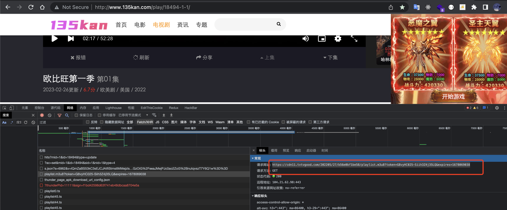
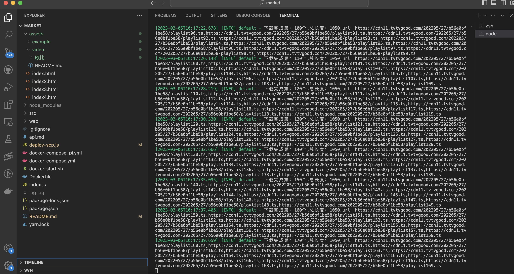
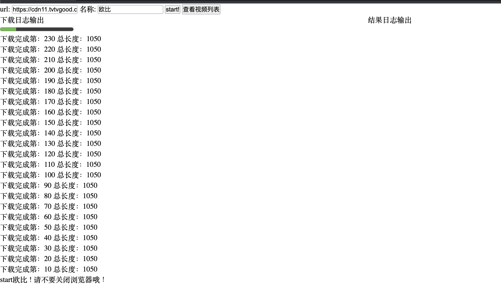
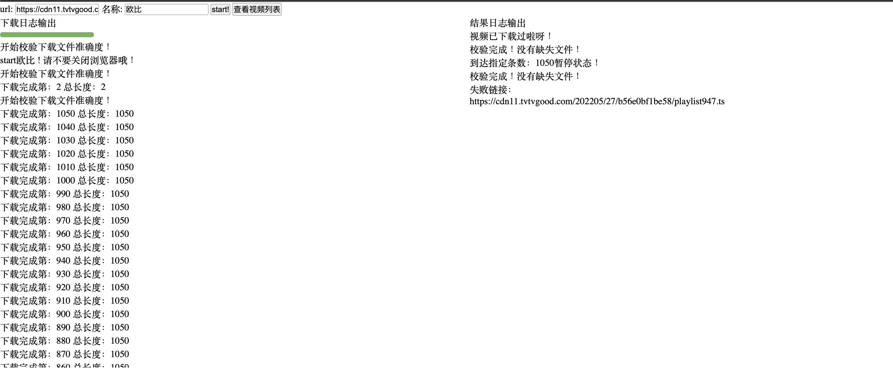
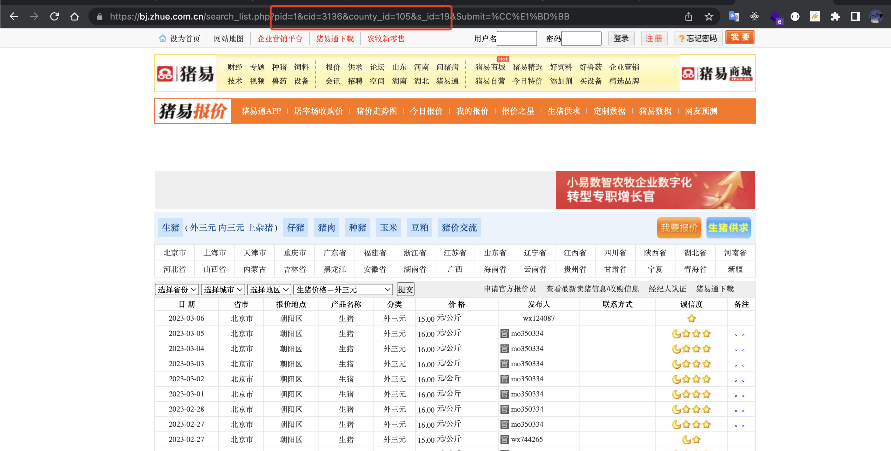
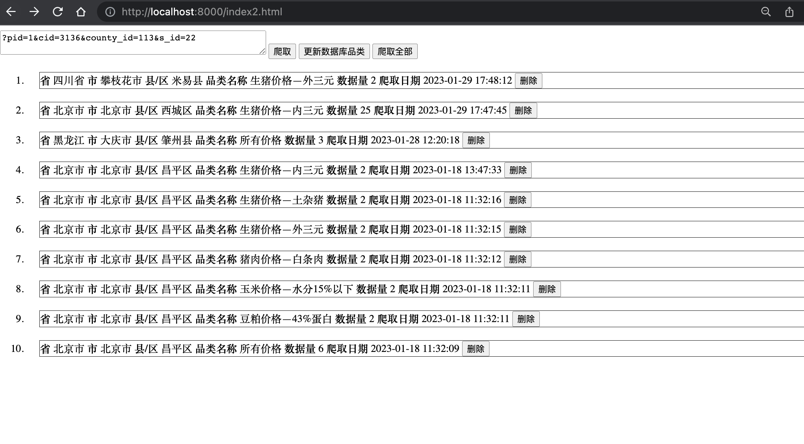

> 1. yarn 
> 2. yarn start 

## 部署
> 本地提交文件 yarn deploy-scp.js
> 服务器创建docker 数据卷 volumes
```
mkdir -p /home/mysql2/conf /home/mysql2/logs /home/mysql2/data
chmod -R 777 /home/mysql2/data*
chmod -R 777 /home/mysql2/logs*
```
> 服务器重启 docker bash ./docker-start.sh

## 防止 sql 注入 mysql.escape
```
    1. sql 注入
    const id="19'-- '" // "19'-- '"
    const sql=`SELECT * FROM categroy where categroy_id='${id}' AND categroy_name='种猪—长白公猪'`;
    2. 解决 sql 注入
    const id=db.mysql.escape("19'-- '"); // '19\'-- \''
    const sql=`SELECT * FROM categroy where categroy_id='${id}' AND categroy_name='种猪—长白公猪'`;

    router.get('/viewCommodity1', async (ctx, next) => {
        const id="19'-- '" 
        const sql = `SELECT * FROM categroy where categroy_id='${id}' AND categroy_name='种猪—长白公猪'`;
        const list = await db.query(sql);
        Http.success(ctx, "成功", { list: list });
    })

```

## 视频下载使用
> http://localhost:8000/ 访问地址
> http://www.135kan.com/play/18494-1-1/ 下载地址






## 养殖爬虫
> http://localhost:8000/index2.html 访问地址
> https://bj.zhue.com.cn/search_list.php?pid=1&cid=3136&county_id=105&s_id=19&Submit=%CC%E1%BD%BB 爬虫地址




